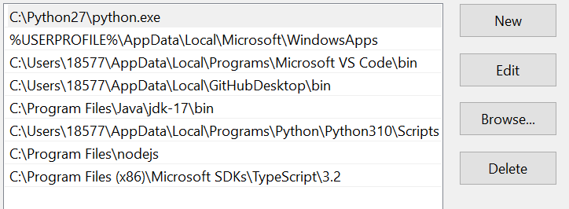
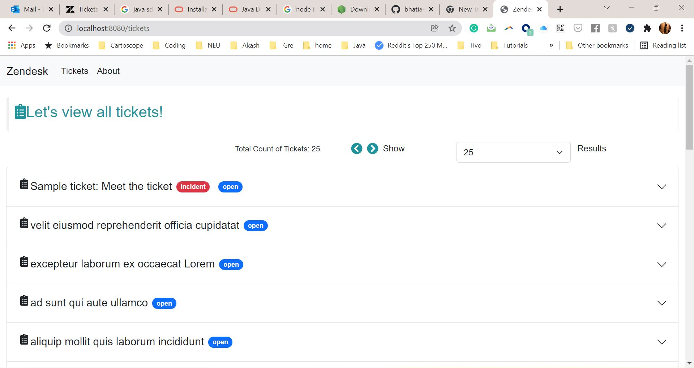
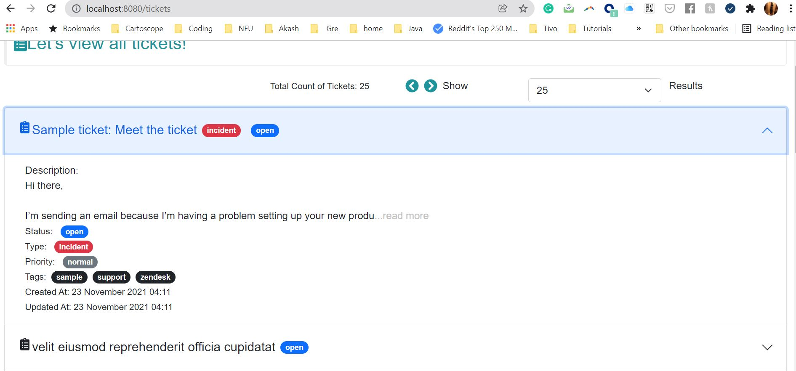
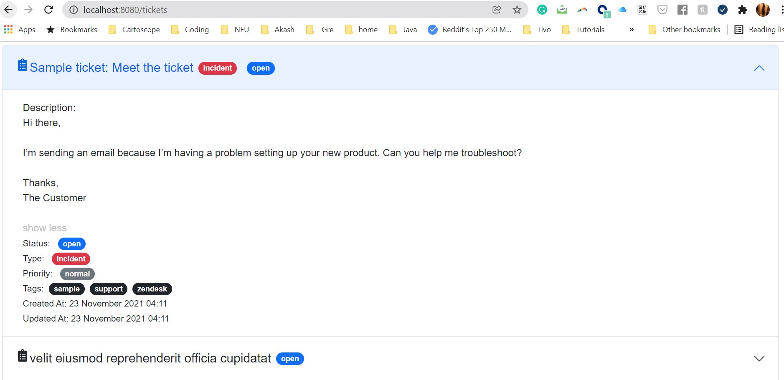
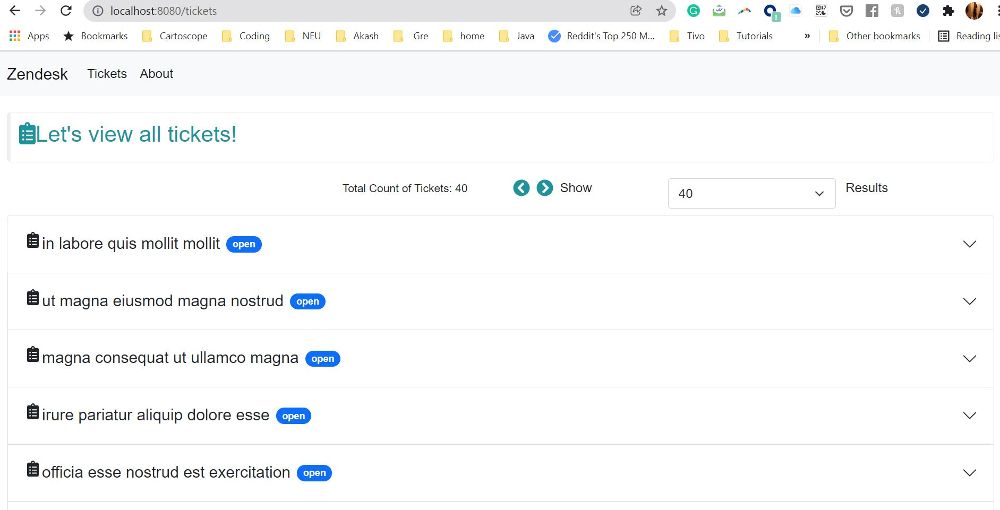
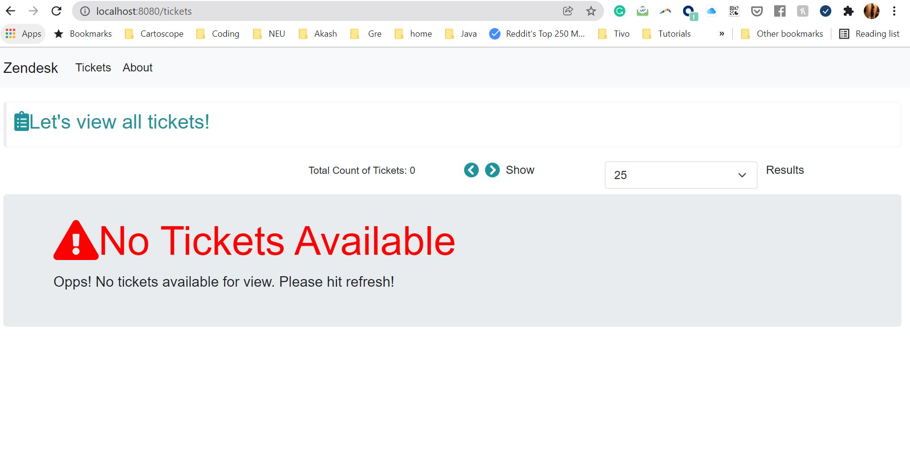
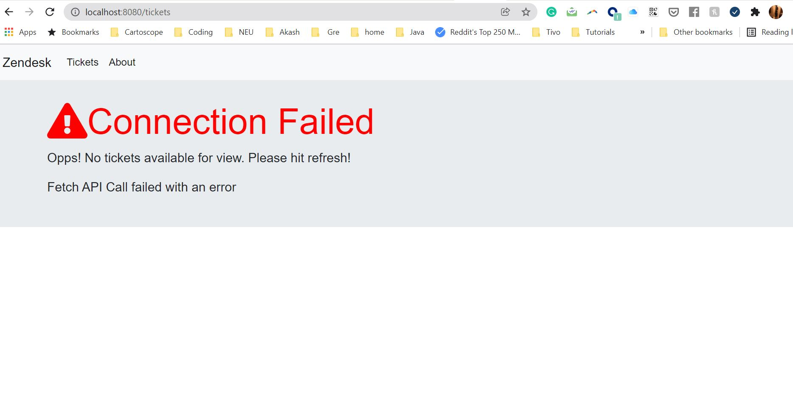

Zendesk Ticket Viewer
# Primary Information:
1. Server port: 8080
2. User Interface: http://localhost:8080
3. Back end: **_Spring Boot, Java, JUnit_**
4. Front end: **_React, Webpack, Babel_**

# Steps to start the application on your local machine
1. Install Java SDK version 17 | Open Link https://www.oracle.com/java/technologies/downloads/
2. Install Node v17.0.1 | Open Link https://nodejs.org/en/download/current/
3. Ensure your path variables include jdk and nodejs path
4. Refer example below
5. 
6. Install Maven Plugins in your IDE
7. Run mvn clean
8. Run mvn install
9. **_Update your username and password in directory:_** **_zendesk_ticket_viewer_rest\zendesk_ticket_viewer_rest\src\main\resources\application.properties_**
10. Run main class **_ZendeskTicketViewerRestApplication_**
11. This would start up the back end server.
12. Open Terminal. Go to directory: zendesk_ticket_viewer_ui
13. Run command: npm install. This would install all required npm modules and create a package-lock.json file.
14. Run command: npm start
15. Open http://localhost:8080

# Actual User Interface Screens developed in React JavaScript Frame work
1. View All Ticket Information:
2. 
3. Detailed Ticked View with limited words in description:
4. 
5. Detailed Ticket View with full description:
6. 
7. Paginate by click left and right arrows and change page size by selecting number of rows in the user interface:
8. 
9. When there are no tickets to show:
10. 
11. When Zendesk API responds with a 400 or error response:
12. 

# Design Choices made during developing the front-end solution
1. Hooks based React Generic components created to deliver a streamline look
2. Webpack used to enable proxy and other build capabilities
3. bootstrap, react-bootstrap used to develop and beautify components.
4. Moment used to parse dates
5. Iconography supported through font-awesome
6. Users can play with the page size and have a smooth experience with paginating through tickets

# Design Choices made during developing the back-end solution
1. Used Spring Boot and Rest template to connect & consume REST API
2. Basic Authorization technique used to fetch response from zendesk
3. Configured the username / password and URL in the application.properties
4. **Jackson** used for serialization and de-serialization.
5. Filtered out all tickets which have the property **is_public as false** value. This was done to avoid any private tickets being visible in the public view.
6. Leveraged **@ControllerAdvice** to propagate errors to user interface in a friendly manner
7. Leveraged **JUnit and Mockito** to test out different Classes.